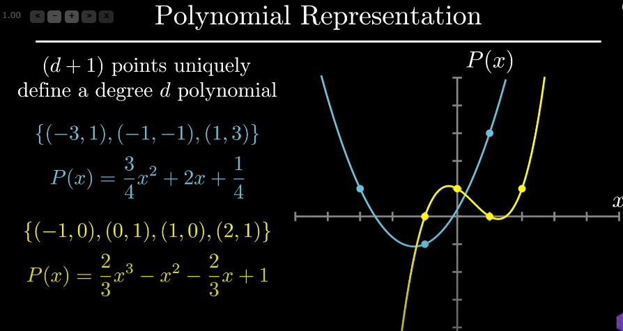
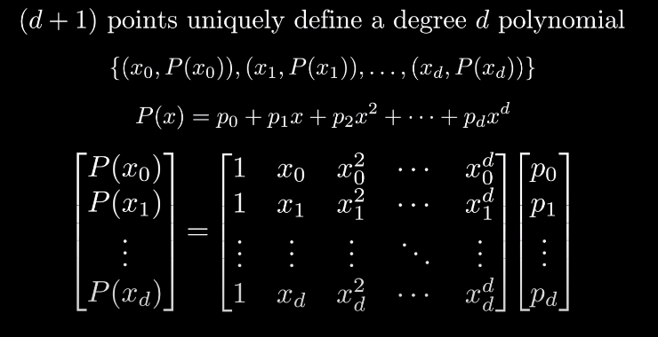
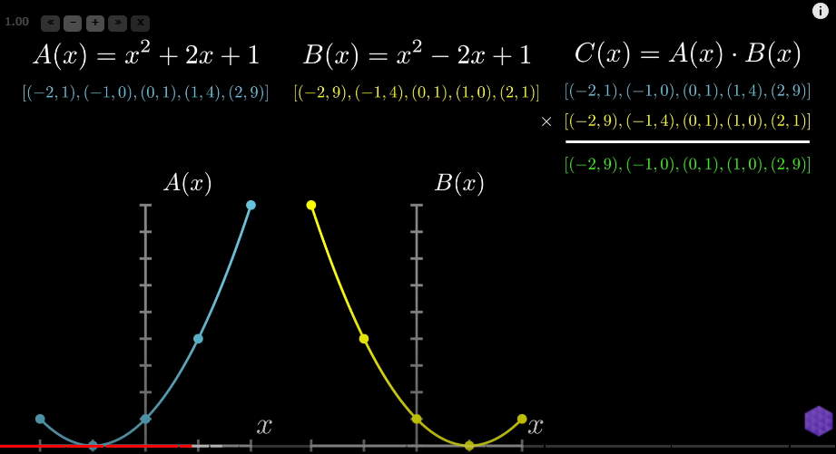
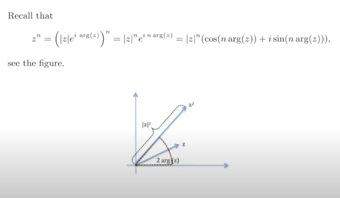
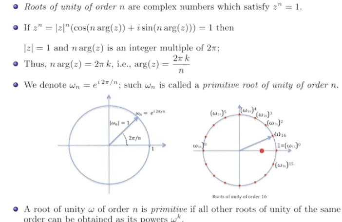
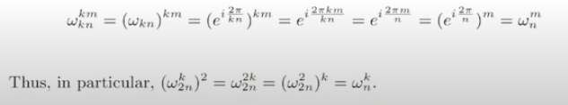

# Fast Fourier transform

### multiplying two polynomials

(d+1) points uniquely define a polynomial of degree d

proof of the lemma in the previous section

- 

- with a system of equations, matrix vector product

- if each of the points are unique, matrix M is invertible
  - calculating determinant
  
- 

  

- using $x^2$ property to halve the need from 8 points to 4 points

  - f(2) =  f(-2)
  - but needed positive negative pairs
  
- need positive negative

  - complex roots of unity
  - since this gives positive negative pairs at each power

  

- use roots of unity so the coefficients do not explode

  

  

  

- **squares of roots of unity of order n are roots of unity of order n/2 if n is even number**
  - 

## Discrete Fourier Transformation

