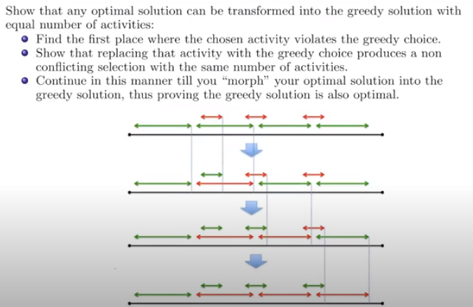

# Greedy method

## Proving optimality of greedy solution

Assume exists an optimal solution better than greedy. Show the greedy strategy allows us to morph the allegedly better solution with one compliant with the greedy strategy

- this will be a contradiction because we assumed that the optimal solution is better than greedy, when it isn't.

- there is often several optimal solutions compliant with greedy

  - 

  

