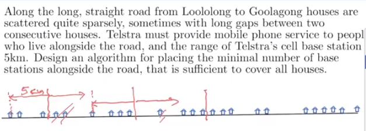
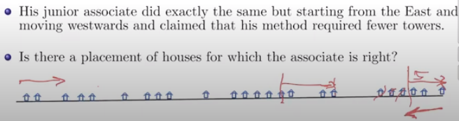

# Greedy method

## Proving optimality of greedy solution

Assume exists an optimal solution better than greedy. Show the greedy strategy allows us to morph the allegedly better solution with one compliant with the greedy strategy

- this will be a contradiction because we assumed that the optimal solution is better than greedy, when it isn't.

- there is often several optimal solutions compliant with greedy

  - 

- Activity selection problem (i.e. the one above)

  - what is time complexity of algorithm?
  - sort in ordered pairs with starting and finishing time
    - O(nlog(n))

- Activity selection II

  - maximal total duration 

    - if activities are of same duration --> same as finding selection with largest number of non-conflicting activities

    - if activities are not of same duration?

      - **greedy strategy does not work **

        - would require dynamic programming

        

## More problems for greedy method

### Telstra poles 

## 

- prove it is a optimal solution
  - assume exists a better solution which starts to the left of the greedy solution
    - simply show that greedy solution also encompasses the same area covered by optimal solution
    - it is just shifting the 'optimal' solution to the right
- greedy generates one of THE OPTIMAL solutions
  - not possible to generate a solution based on the direction in which you start
    - i.e. starting right to left instead of left to right
  - there might be a different optimal solution based on placement, but the total number of poles placed are going to be optimal

### Greedy method to graphs

- Given directed graph G= (V,E)
- strongly connected component G is a graph where
  - u -> v and also v-> u
    - all vertices can go to another vertex and back.

##### understand this

- construct another graph G' = (V, E') consisting of same set of verticies V but with sed of edges which is reversing the direction of all edges 
  - use BFS to find the set of vertices in V which is reachable in G from *u*
  - ????

