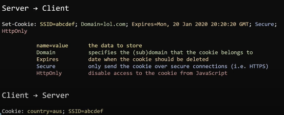
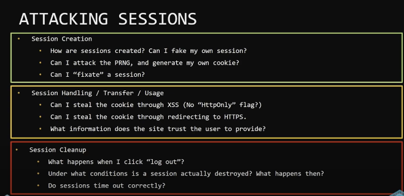
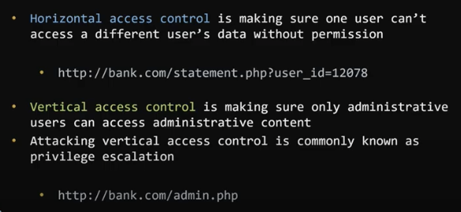
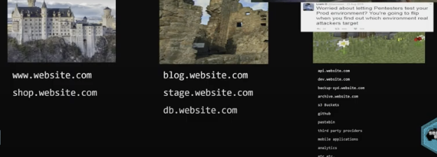
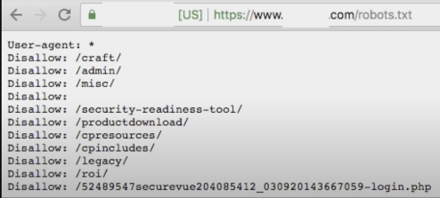
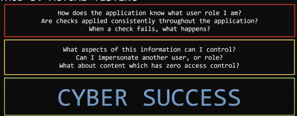
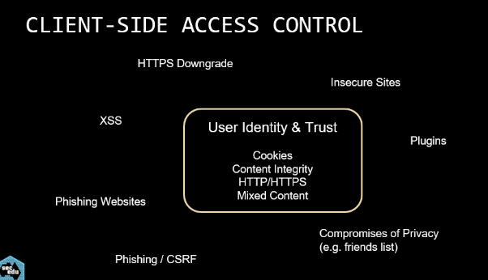
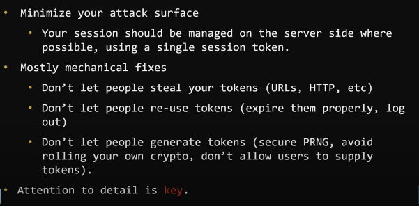

# Week 3 lecture

## HTTP and HTTPs

- Tcp connection opened with the server
- Bidirectional communication stream

## TLS

- TLS handshake

  - server sends a certificate and the client verifies that the certificate
  - certificate chain
  - OS come loaded with certificate authorities

- Can HTTPS be MITM'd?

  

- http redirect to https is problematic

  - the http site is still susceptible to MITM

## Session management

## Attacking Sessions

- race conditions?
- concurrent session check?
  - check if another low privilleged user in another browser's session id is the same as the admin accounts
- understand how sessions are created
- look at stealing/transferring
- look at expiry and clean up

bugmenot -> website for test credentials

## Access control

#### Access control types

- DAC (discretionary access control) 
  - NTFS
  - file system
- RuleBAC and RoleBAC
  - rule or role based
  - Attribute
- Parameter-based
  - Firewall and modern routers

Access control and what happens when a person's role changes? e.g. sysadmin becomes a normal developer

sessionIds should be terminated, if not: replay attacks can occur.

client side does the sessionid validation, so vulnerability might only be visible through burp suite since the server side might not perform the same validations.

do not do client based access controls

#### Types of web access controls

- security through obscurity
- one off access control
- rule based access control

#### Rule based access control: Horizontal vs vertical

if two students with same permissions are able to access each other's files, that is horizontal access, but getting the lecturers account is vertical.

#### Attacking access control

Method 1: Bypass entirely

domain enumeration

- Wordlist enumeration
- look at other information and use custom words not within wordlist

Method 1.5: Robots.txt

Method 2: Application trace

- **.wotf**
- stack traces

Method 3: Actual testing

## 2FA

- can attack one time passwords
  - once one time password has been used, do not allow it to be reused
  - hijack their sms 
  - If OTP locks users out, it can be like a ddos attack
- sms
- mobile app
- key generator
- fingerprint
- channel-based
- location-based
- biometric

## Oauth

if facebook integration is not performed correctly, attacker can gain access to facebook account

- Authorisation grant
- implicit grant
- resource owner credentials
- client credentials

## Defending your sessions

