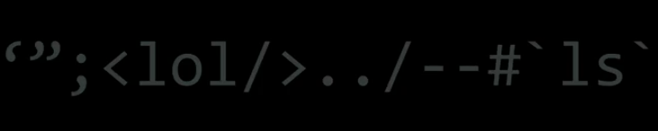
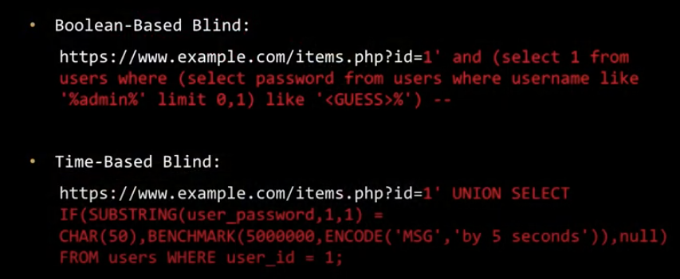
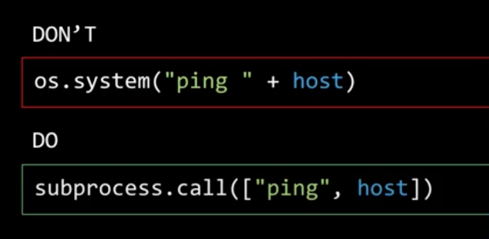

# Server side attacks

Probing for vulnerabilities

think like the developer, how would I implement e.g. the query table

first thing to do when I deploy database, rename default information.schema 

## Blind SQLi

exfiltrate data using function primitives

- functions and can use if statements and functions like sleep
  - time based blind sqli

## Local file inclusion

- getting /etc/passwd of server?

## Cmd injection

