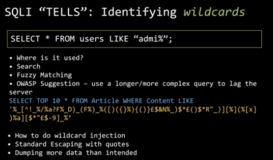
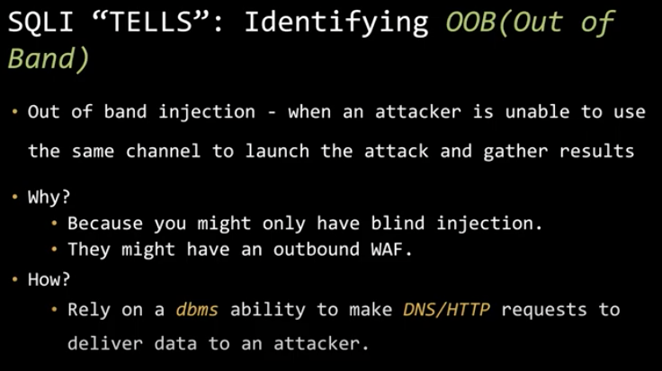
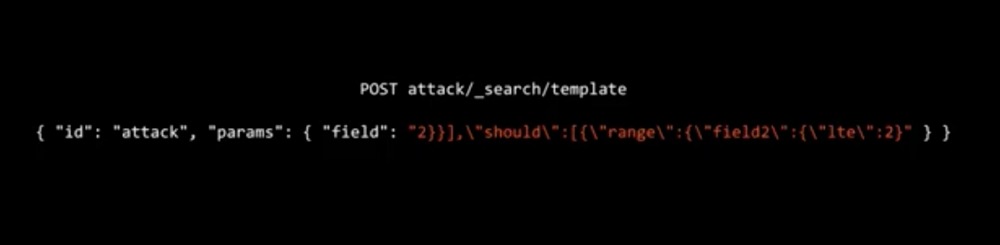

# Server side attacks

Probing for vulnerabilities

think like the developer, how would I implement e.g. the query table

first thing to do when I deploy database, rename default information.schema 

## Blind SQLi

exfiltrate data using function primitives

- functions and can use if statements and functions like sleep
  - time based blind sqli

## Local file inclusion

- getting `/etc/passwd` of server?

## Cmd injection

## Sqli tells

- error messages
- boolean based
- comments
- time based

- using injecting subqueries

- using sql functions

  - `Chr(), cast(), concat(), xpcmdshell()`

- fingerprinting the DBMS

  - `@@version, version(), sqlite_version()`

  

blind sql payload example

`' or (select (subset((select password from users where sid='s5000009'), 1,1) = 'a')-- )`

## NOSQL injections

### Template injection

injecting a object payload

- `{"$exists":true}`

### SSTI (server side template injection)

example payload for RCE

`{{ "".__class__.__mro__[1].subclasses__()[444](["cat","/etc/passwd"],stdout=-1).communicate }}`

### Business logic exploitation

- challenging assumptions of developer
- edge cases
- overwriting some files

