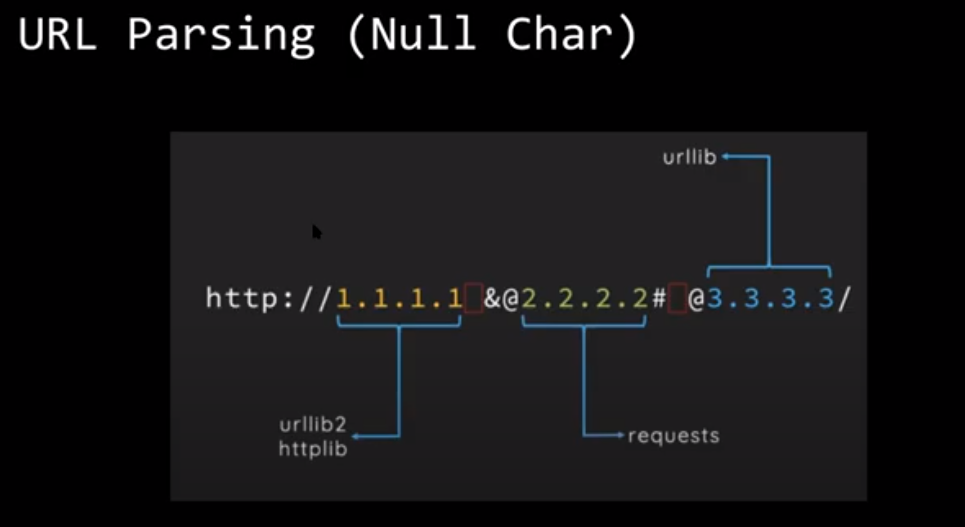

## Server side include

- difference between ssti and ssi?
  - basically just looking at the template
  - server side include variants
    - A:\
    - http://
    - gopher:// (and other non-http)
    - \\\blah\ (unc path)
    - localhost (other local names)
    - ::1 (ipv6)
    - local web services?

## Directory traversal

## Csv injection

- excel macros to pop a shell or open an app
- excel warns about security concerns
  - however can bypass that by putting in crucial features that require macros in it
  - as well as putting in the malicious input as well

## rest apis

- stateless
- 1 api for webservers,mobile apps, iot devices etc.
- attack vectors
  - injection attacks
  - broken function and object level authorisation
    - dropbox critical bug having only access to app folder being able to post and enumerate files of any folder
    - idor
      - usually a design vulnerability
  - excessive data exposure
  - rate limiting
  - restricting insecure usage of HTTP methods
  - leaking token, caching etc
  - mass assignment
  - security misconfiguration

other takeaways

- uing UUIDs not INT
- post vs get
- cache headers
- user access map
- permissions libraries
- edge cases
- not too many nested ifs
- look at code logic when refactoring

## GraphQL vulnerabilities

/graphql is usually visible and public for most websites

## XXE

- /web root
  - contains images, config files

## SSRF

