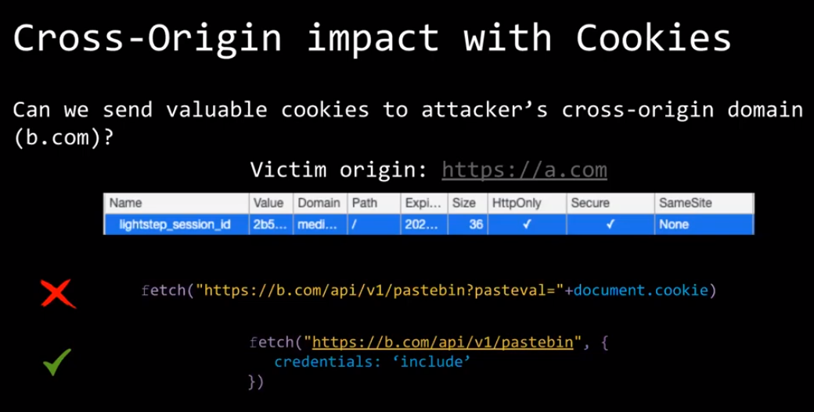
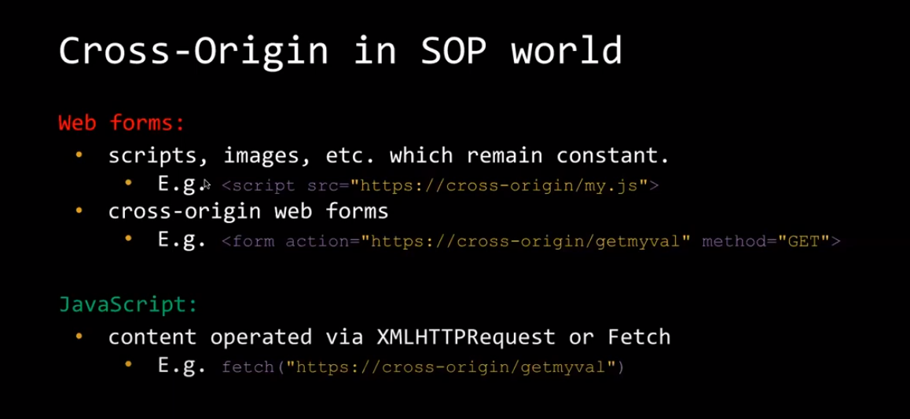
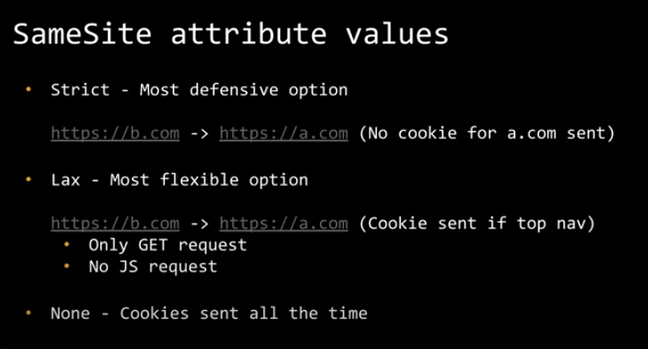
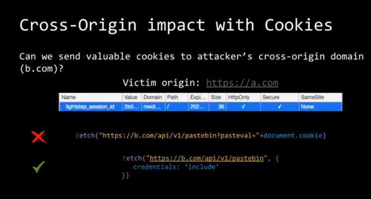
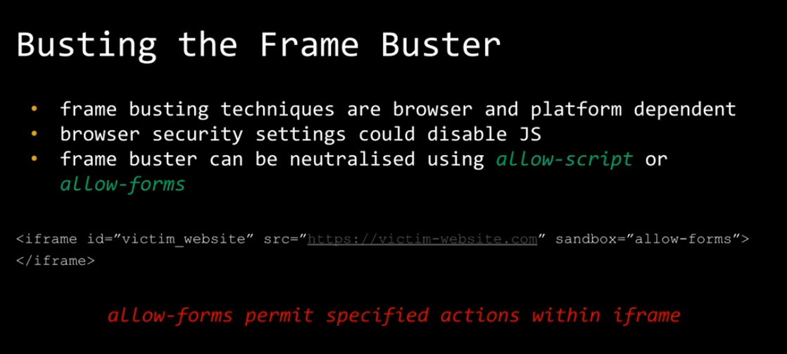
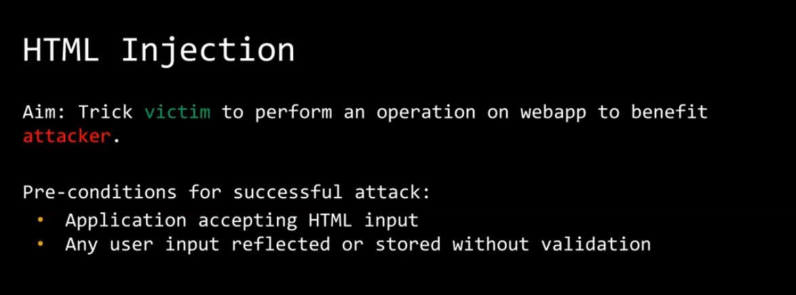

# Week 7 Same origin policy

CORS protects against the first scenario but not the second

CORS protects against javascript executed code such as fetch(), but not web forms or script/image tags 

# Cross origin Vs Cross site

- cookies such as HTTP only follows same site rule 
- javascript methods such as fetch follow same origin policy

those two are different

- HttpOnly - allow/deny JS accessing cookie
- Secure - set/send cookie through TLS
- SameSite - send/block cookie to cross-site

If an attacker has access to a subdomain, they are same site and any strict cookie tags are circumvented, i.e. they can bypass the strict rule since it is a same site request.

- subdomain takeover

## Click Jacking

## HTML injection

